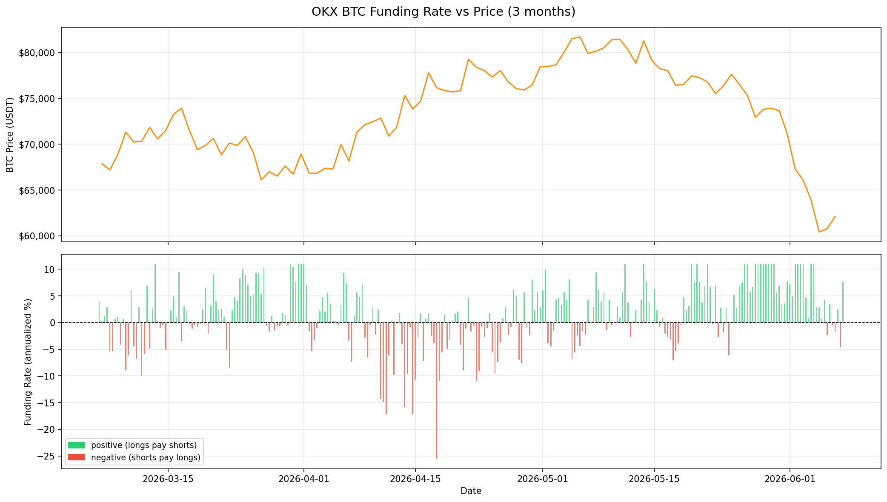
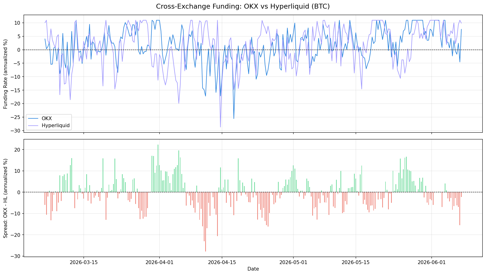
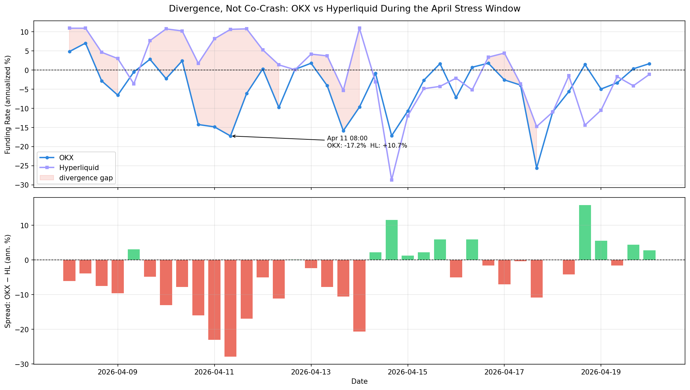
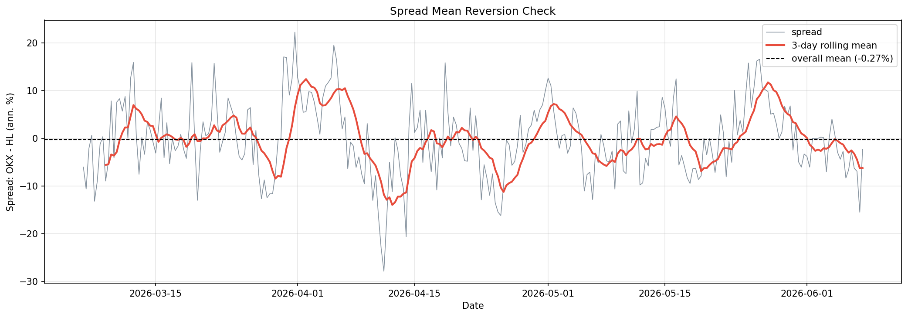
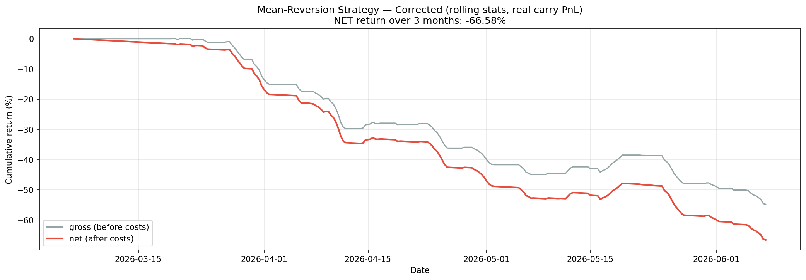

# Cross-Exchange Funding Rate Arbitrage: A Reality Check

A quantitative research project on BTC perpetual funding rates across OKX (CEX) and Hyperliquid (DEX) — testing whether the cross-exchange funding spread is a tradable opportunity, and discovering why a naive approach loses money.

**TL;DR:** The spread is statistically mean-reverting (ADF p < 0.001), which sounds like an arbitrage opportunity. But an honest backtest — no look-ahead bias, real carry cash flows, retail transaction costs — loses **-66.6% over 3 months**. The gap between "statistically significant pattern" and "executable strategy" is the entire story of this project.

---

## Motivation

Delta-neutral funding carry (long spot + short perpetual) is a classic crypto strategy: hedge away price risk, collect the funding rate. A cross-exchange variant goes one step further — long the perp on the venue with lower funding, short on the venue with higher funding, and pocket the spread.

This project asks three questions:

1. What does the funding rate actually look like, statistically?
2. Does a persistent, tradable cross-exchange spread exist?
3. Can a retail-level participant capture it after costs?

## Data

| Source | Instrument | Frequency | Period | Records |
|---|---|---|---|---|
| OKX public API | BTC-USD-SWAP funding | 8h | 2026-03-06 → 2026-06-07 | 281 |
| Hyperliquid public API | BTC perp funding | 1h (aggregated to 8h) | same window | 2,367 → 281 |

Hyperliquid settles funding hourly vs. OKX's 8-hour cycle, so HL rates are summed into 8h buckets aligned to OKX settlement times before any comparison. All rates are annualized (×3×365) for readability.

*Note: public API history depth limits the sample to ~3 months. This is the project's largest limitation — see [Limitations](#limitations).*

## Key Findings

### 1. Funding is left-skewed and fat-tailed

OKX BTC funding over the window: mean +1.43% (annualized), median +1.78%, std 6.09%, min **-25.59%**, max +10.95%. The distribution is the classic carry profile — small steady gains punctuated by deep negative spikes. The mean does not describe the risk; the left tail does.



### 2. The fixed-direction spread has no edge

Spread (OKX − HL, annualized): **mean -0.27%**, std 7.76%, range [-27.88%, +22.26%]. A static "always short OKX / long HL" position earns approximately nothing on average — neither venue is persistently hotter. Whatever opportunity exists lives in the *fluctuations* of the spread, not in holding a fixed direction.



### 3. Stress arrives off-peak, not in sync

During the April 2026 drawdown, both venues printed deep negative funding — but **3–6 days apart** (OKX min on Apr 17, HL min on Apr 14, spread extreme of -27.88% on Apr 11 when OKX was at -17% while HL sat at +11%). Cross-venue correlation stayed flat through the stress window (0.358 vs 0.351 full-period): neither co-crash nor systematic divergence, but **staggered shocks**. For a spread position this is worse than co-movement — desynchronized stress is exactly what throws the spread to extremes, meaning the strategy's source of return and source of tail risk are the same phenomenon.



### 4. The spread is mean-reverting — but slowly

- ADF test: statistic -5.003, **p < 0.0001** → reject unit root, the spread is stationary/mean-reverting
- Autocorrelation decays smoothly: 0.627 (8h) → 0.453 → 0.427 → 0.335 → 0.280 → 0.192 (48h)

The spread behaves like a ball on a loose rubber band: it always comes back to ~0, but deep dislocations take *days* to repair. That slowness turns out to be fatal.



### 5. The backtest: a lesson in look-ahead bias

**First attempt (flawed):** threshold strategy using full-sample mean/std and treating spread *changes* as PnL → **+328%** over 3 months with a nearly monotonic equity curve.

A curve that perfect is not a discovery; it is a bug report. Two violations:

1. **Look-ahead bias** — entry/exit thresholds used the full-sample standard deviation, information unavailable in real time.
2. **Wrong PnL definition** — a carry trader earns the *funding itself* each period (position × current spread), not the change in an indicator.

**Corrected backtest:** rolling 30-period (~10-day) mean/std computed only from past data, real per-period carry cash flows, 0.05% taker fee × 4 fills per position switch:

| Metric | Naive (flawed) | Corrected |
|---|---|---|
| Gross return (3 months) | +340 pts | **-54.8%** |
| Transaction costs | 12.2 pts | 11.8% |
| **Net return** | **+328 pts** | **-66.6%** |
| Position switches | 61 | 59 |



**Why it loses:** the rolling signal is inherently lagged. Because reversion is slow (finding #4), by the time a dislocation is statistically confirmed, the spread is already turning — the strategy systematically enters late, gets caught on the wrong side, and bleeds negative carry plus fees while waiting for a reversion that arrives too late to pay for the trip.

## Interpretation: limits to arbitrage, measured

The corrected result is not "the strategy is fake." It is a measurement of **how high the execution barrier is**. The spread's mean reversion is real, but capturing it requires what retail participants lack: low-latency execution (to beat the signal lag), institutional fee tiers (to survive the switching costs), real-time cross-venue margin management (to survive staggered stress, finding #3), and risk systems that act in minutes rather than 8-hour bars.

The opportunity persists *because* harvesting it naively loses money — a textbook case of limits to arbitrage, reproduced on a $0 research budget.

## Repository structure

```
├── README.md
├── requirements.txt
├── src/
│   ├── fetch_okx.py              # OKX funding history (paginated, incremental)
│   ├── fetch_hyperliquid.py      # Hyperliquid funding history
│   ├── build_spread.py           # align 1h→8h, merge, annualize, spread stats
│   ├── analysis_stress.py        # April stress window + correlation analysis
│   ├── analysis_meanreversion.py # ADF test + autocorrelation
│   └── backtest.py               # corrected backtest (and the flawed one, kept for the lesson)
├── data/                         # CSVs written by fetch scripts
└── figures/                      # charts written by analysis scripts
```

Run order: `fetch_okx.py` → `fetch_hyperliquid.py` → `build_spread.py` → analyses → `backtest.py`.

## Limitations

Stated plainly, because they matter:

- **3-month sample (281 8h periods).** Public API depth constraint. One market regime (a drawdown); findings may not generalize to bull or sideways markets.
- **In-sample parameters.** The backtest's window/threshold choices (30 periods, 1.0σ entry, 0.5σ exit) were not optimized, but neither were they validated out-of-sample — the sample is too short to split meaningfully.
- **Cost model is simplified.** Flat 0.05% taker fee per fill; no slippage, no funding-payment timing effects, no margin/borrow costs.
- **Two venues, one asset.** OKX–Hyperliquid BTC only; other pairs may behave differently.

## Future work

- Extend the sample to 1–2 years via third-party aggregated data (multiple market regimes, meaningful train/test split)
- Add ETH and additional venues (CEX–CEX vs CEX–DEX spread behavior)
- Replace threshold rules with a forecasting approach (funding-regime classification) — only viable with a much larger sample
- Tail-risk quantification (CVaR) of the carry distribution

## Disclaimer

This is an independent research and learning project using public market data. It involves no live trading, no exchange accounts, and is not investment advice.
